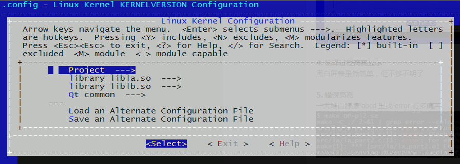
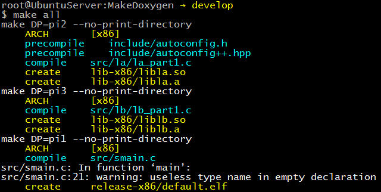
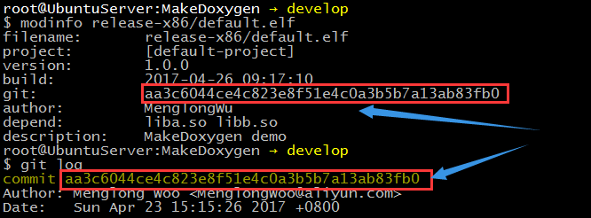
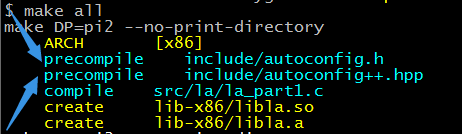
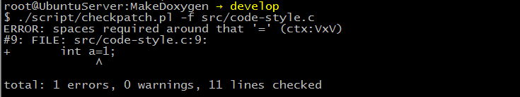
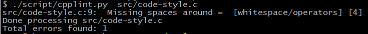
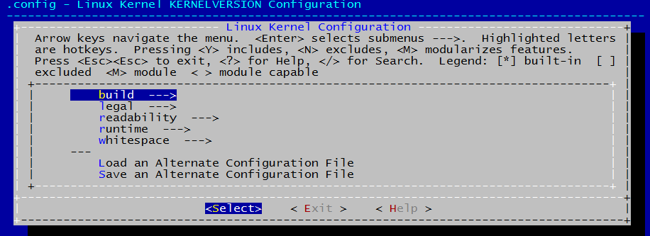

MakeDoxygen
===========
> 作者: 吴梦龙

# 1 什么是MakeDoxygen
  首先它是个linux工程 __Makefile模板__ ，其次它也像是字符界面的IDE，
  它不主动创造轮子，
  除非世界上本没有合适的轮子，
  它的“代码风格审查”特性就是个使用现有轮子的实例，
  风格支持Linux Kernel标准、Google标准。

  与普遍的linux开源工程不一样的是，它只拥有一个Makefile来构建，
  而无需在各个子目录下散落Makefile。
  如果你实在想保留金典的散落Makefile风格，MakeDoxygen也可以满足你，这两篇文章
  会给你启示
  [《3min搭建Hello World》](./doc/simple-guide.md)、
  [《rule.mk自定义规则》](./doc/doc-rule.md)

# 2 怎样用到你的工程
  在决定使用MakeDoxygen前，先验证你的环境是否符合 
  [《环境验证》](./doc/doc-transplant.md)

  了解MakeDoxygen工作方式
  [《MakeDoxygen结构》](./doc/doc-makedoxygen.md)
  
  快速入门
  [《3min搭建Hello World》](./doc/simple-guide.md)

  最后看看MakeDoxygen可以干些什么[《Makefile都有些什么》](./doc/doc-makefile.md)

# 3 以下情况你可以考虑选择MakeDoxygen
## 3.1 管理多子工程
  [教程《listprj.mk多工程列表》](./doc/doc-listprj.md)  
  [教程《common.mk子工程公共配置》](./doc/doc-common.md)  
  [教程《project.mk 子工程特有配置》](./doc/doc-project.md)  
  [教程《filelist.mk 文件树》](./doc/doc-filelist.md)  

```
$ make lp
        pi1=script/default
                pi1_arg=elf
        pi2=script/prj_liba
                pi2_arg=mlib
        pi3=script/prj_libb
                pi3_arg=mlib
        pi4=script/prj_qt
                pi4_arg=elf
        pi5=script/prj_cpp_c
                pi5_arg=elf
        pi6=script/prj_moc
                pi6_arg=elf
        pi7=script/prj_printl
                pi7_arg=elf
```

## 3.2 快速配置程序特性
  [教程](./doc/doc-menuconfig.md)

  图像化配置程序各种版本特性（调试版本、功能特性、发布版本）

  

## 3.3 编译过程高亮

  
## 3.4 警告、错误高亮
  [教程](./doc/doc-makefile.md)

  
  


## 3.5 版本控制信息
  [教程](./doc/doc-gitsha1.md)

  用户反馈产品有缺陷，对于数周发布一新版本的产品线，我怎么知道用户当前使用的是哪个版本，
  每个应用程序都有编号，编号与版本控制对应

  

## 3.6 预编译机制
  [教程](./doc/doc-precompile.md)

  提高代码再次编译速度，缩短头文件包含依赖

  

## 3.7 多类型输出文件
  [教程](./doc/doc-listprj.md)

```
root@UbuntuServer:MakeDoxygen → develop
$ ls release-x86/
default.elf  
root@UbuntuServer:MakeDoxygen → develop
$ ls lib-x86/
libla.a  libla.so
root@UbuntuServer:MakeDoxygen → develop
```
## 3.8 代码风格审查
  [教程](./doc/doc-code-style.md)

```
 1 /**
 2  * Copyright 2015-2017 MenglongWoo@aliyun.com
 3  * @file  src/smain.c
 4  * @brief  example for MakeDoxygen
 5 */
 6 
 7 void fun(void)
 8 {
 9   int a=1;
10   int *p = (int *)&a;
11 }
12 
```

  支持 __Linux Kernel__ 代码风格审查

  

  __Google__代码风格审查

  
  
  __Google__ 风格审查自定义

  

# 4 未来特性
## 4.1 代码质量审查
  [教程](./doc/doc-code-review.md)

  - 可能使用splint
  - 配置方式与cpplintconfig一样

## 4.2 代码覆盖率测试


## 4.3 博客管理
### 4.3.1 MakeDown转静态html
  - 不使用用jekyll，它太慢了
  - 使用Python或Hexo
  - html可加载定制的css、js属性
  - 支持 html 模板（div排版）
### 4.3.2 支持博客内容搜索
  - 静态网页搜索机制是制作一个小型爬虫，只给本博客建立关键字
  - 博客标题搜索
  - 博客tag搜索

# 5 修改历史
  [Changelog](./Changelog)


# 6 已知缺陷

参考 [BUG.mk](./BUG.md)


---


# 7 联系
**Email:**MenglongWoo@aliyun.com

# 8 下载模板
git clone https://github.com/MenglongWu/MakeDoxygen.git

