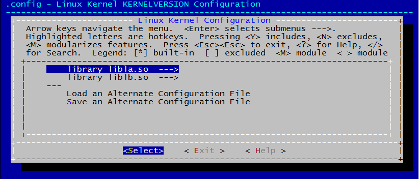
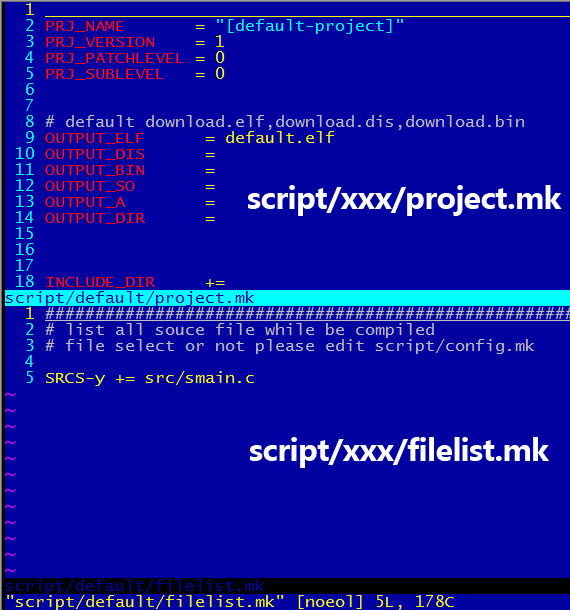

> Author: Menglong Woo

# MakeDoxygen

## 1. 介绍

本工程是一个通用型工程模板，工程里可以方便管理若干子工程，与普遍的linux开源工程不一样的是，它只拥有一个Makefile来构建，而无需在各个子目录下散落Makefile。每个子工程通过fileslist.mk和project.mk描述，各子工程的描述文件放于各自工程目录，默认工程目录位于script下，如script/SubProject、script/default。从linux源码目录里分离出mconf工具用于实现make menuconfig配置工程，生成的.config用本工程自带的工具mkheader生成include/autoconfig.h。

编译过程高亮显示，差错清晰明了。

## 2. 构建
Makefile基本可以作为一个通用模板，无特殊需要无需做修改。  
通常需要修改的是其余脚本:

- [Makefile](#makefile_target)
- [common.mk](./script/README.md)  
- [config.mk](./script/README.md)  
- [listprj.mk](./script/README.md)  
- [project.mk](./script/README.md)   
- [filelist.mk](./script/README.md)   
- [allprj.mk](./script/README.md)   
- [Kconfig](#kconfig)

根目录下的Makefile是工程管理入口；  
allprj.mk本工程中所有子工程的依赖关系（也可以没有依赖）；  
common.mk本工程所有子工程所共有的配置如环境变量、生成目录、库路径等；  
listprj.mk列出所子工程以及其子工程目录；  
filelist.mk子工程各自所包含的源文件；  
project.mk子工程各自的编译选项，部分参数的缺省值在common.mk文件里；

## 3. 移植

首先尝试不做任何修改的情况下编译测试工程，如无任何错误才可根据需求修改模板。

配置工程menuconfig保存默认配置直接退出保存，生成 **.config** 与 **include/autoconfig.h**


```
root@UbuntuServer:MakeDoxygen$ make menuconfig
make -C script/kconfig
./script/mkheader/mkheader .config include/autoconfig.h "[default-project]"
read config file :.config
make header file :include/autoconfig.h
```
编译生成libla.so liblb.so dafault.elf三个子工程最终文件，证明模板正常使用。

具体如何在模板基础上定制自己的工程详细阅读 (构建)[1]
```
root@UbuntuServer:MakeDoxygen$ make all
make DP=pi3 --no-print-directory
    ARCH       [x86] 
    compile    src/lb/lb_part1.c 
    compile    src/lb/lb_part2.c 
    create     lib-x86/liblb.so 
    create     lib-x86/liblb.a 
make DP=pi2 --no-print-directory
    ARCH       [x86] 
    compile    src/la/la_part1.c 
    compile    src/la/la_part2.c 
    create     lib-x86/libla.so 
    create     lib-x86/libla.a 
make DP=pi1 --no-print-directory
    ARCH       [x86] 
    compile    src/smain.c 
    create     release-x86/default.elf 
```
<span id="kconfig"></span>
## 4. Kconfig

是选择配置数据库脚本，最终生成.config为目的，如何编辑请参考任意 [linux kernel] 内核文档 (Documentation/kbuild/kconfig-language.txt)

<span id="makefile_target"></span>
## 5. Makefile 目标

- **make menuconfig**

配置工程，编辑 [Kconfig] 修改工程配置选项

- **make**

编译默认子工程

- **make all**

编译所有子工程，默认生成文件位于对应平台目录下，如release-x86 lib-x86

- **make strip**

执行strip去掉所有子工程的ELF格式文件标签

- **make copy**

拷贝所有子工程到指定目录，该目录通常是tftp/NFS等网络共享目录，用存放目标板平台的交叉编译程序

- **make clean**

清除所有子工程生成文件

- **make distclean**

清除所有子工程生成文件，如果对应平台已经清空，则同时删除平台目录。

- **make run**

本地运行总工程下的默认输出文件。通常只有 x86 平台下才可能执行该命令。
如默认执行工程 **pi1** 所生成的download.elf文件，工程配置相对目录 **script/default** ，生成elf格式文件，elf文件命名为 **download.elf**

script/listprj.mk

```
	pi1=script/default
		pi1_arg=elf
export DP=pi1
```

script/default/project.mk

```
OUTPUT_ELF	= download.elf
```

默认输出如下内容:  
对于工程里的几个宏来历查阅 [工程预定义宏](#prj_macro)

```
root@fnc:MakeDoxygen# make run
./release-x86/default.elf
Macro:
        PRJ_NAME      [default-project]
        PRJ_VERSION    1
        PRJ_PATCHLEVEL 0
        PRJ_SUBLEVEL   0
        BUILD_DATE    2015-12-01_16:19:25
asin(1) = 1.570796
test lafun1():  I'm fun1() from libla.so
test lafun2():  I'm fun2() from libla.so
test lbfun1():  I'm fun1() from liblb.so
```
- **make se**
 
show eror 高亮显示编译error

- **make sw**  

show warning 高亮显示编译warning

- **make lp**

列出所有子工程，其中DP指向默认工程配置目录

```
root@UbuntuServer:MakeDoxygen$ make lp
	pi1=script/default
		pi1_arg=elf
	pi2=script/prj_liba
		pi2_arg=mlib
	pi3=script/prj_libb
		pi3_arg=mlib
DP=pi1
```

- **make ep DP=pi1**

同时打开并编辑pi1子工程目录下两个配置脚本project.mk,filelist.mk



- **make gdb DP=pi1**

以gdb调试方式运行子工程pi1的输出文件，条件需要在工程配置脚本 [project.mk] 打开 "-g" 选项

- **make gdb-core**

打开core输出文件调试程序


* make print_env

仅仅为了调试Makefile，输出各环境变量

```
root@UbuntuServer:MakeDoxygen# make print_env 
=========================================================
PRJ_VERSION   = 1.0.0
PRJ_NAME      = [Project Name]

file_common   = /mnt/linuxProject/MakeDoxygen/script/common.mk
file_prj      = /mnt/linuxProject/MakeDoxygen/script/project.mk
file_config   = ./script/.config
file_list     = /mnt/linuxProject/MakeDoxygen/script/filelist.mk
file_lds      = ========== no such file ./script/boot.lds

CROSS_COMPILE =
CC            = gcc
LD            = ld
OBJDUMP       = objdump
OBJCOPY       = objcopy

OUTPUT_ELF    = helloworld.elf
OUTPUT_DIS    = download.dis
OUTPUT_BIN    = download.bin
OUTPUT_SO     = download.so
OUTPUT_A      = download.a
OUTPUT_DIR    = release

INCLUDE_DIR   = -I./
LFLAGS        = -lm
LIB_DIR       = -L/usr/local/install/lib
CFLAGS        = -DTARGET_X86 -DBUILD_DATE="2015-10-19 15:09:22" -DPRJ_VERSION="1.0.0" -DPRJ_NAME="[Project Name]" -g -Wall -static -rdynamic
```

- **make a+xxx**

几乎以上带有 **所有子工程** 含义的目标（除make all外），在目标前加入 **a** 即可只对当前默认工程执行操作。

	- make astrip
	- make acopy
	- make aclean
	- make distclean

- ** make DP=xxx**

本次make临时将xxx工程作为默认工程执行操作，以上任何目标均可添加选项
	
	- make DP=pi3
	- make DP=pi3 acopy
	- make DP=pi3 aclean
	- make DP=pi3 adistclean

## 6. 特性

### 模块

与linux模块驱动一样头文件proginfo.h定义了相同的宏定义MODULE_INFO，编译后生成.modinfo段，此目的是为了在x86平台下在不允许程序的情况下执行modinfo的情况下查看elf文件信息。

```
root@UbuntuServer:MakeDoxygen$ modinfo release-x86/default.elf 
filename:       release-x86/default.elf
project:        [default-project]
version:        1.0.0
build:          2016-11-01_21:30:09
author:         MenglongWu
build:          liba.so libb.so
description:    MakeDoxygen demo
```
<span id="prj_macro"></span>
### 工程预定义宏

- BUILD_DATE  
每次工程编译后表示编译的时间

- PRJ_VERSION\PRJ_PATCHLEVEL\PRJ_SUBLEVEL  
子工程的版本信息，位于project.mk

- PRJ_NAME  
子工程名，位于project.mk


## 7. 已知缺陷

参考 [BUG.mk](./BUG.md)


---


## 联系
**Email:**MenglongWoo@aliyun.com

## 下载模板
git clone https://github.com/MenglongWu/MakeDoxygen.git


[common.mk]:(./script/README.md)  
[listprj.mk]:(./script/README.md)  
[project.mk]:(./script/README.md)   
[filelist.mk]:(./script/README.md)
[BUG.mk]:(./script/README.md)
[Kconfig]:(./README.md)
[linux kernel]:https://github.com/torvalds/linux
