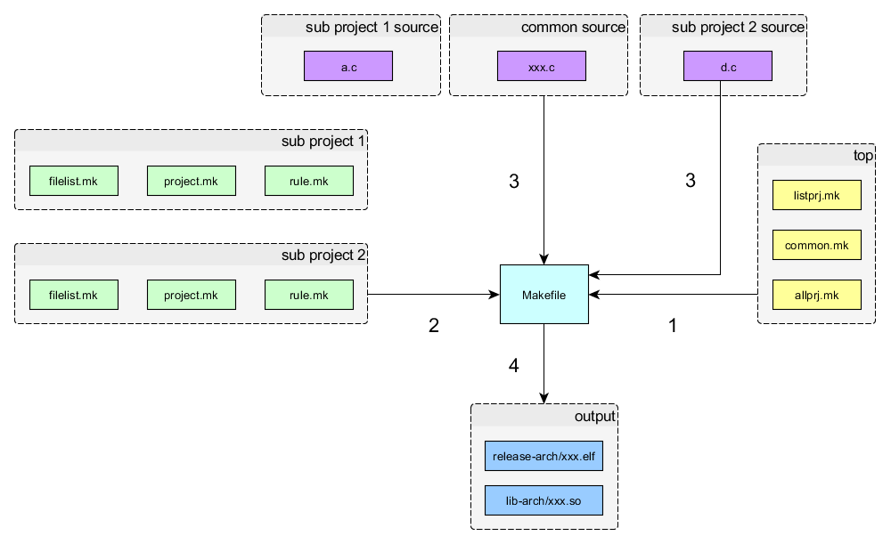

MakeDoxygen结构
=======================

  

  
  - 根目录下的Makefile是工程管理入口；  

  - listprj.mk描述有多少子工程
  
  - allprj.mk 所有只工程之间存在的依赖关系

  - common.mk 所有子工程的公共配置

  - filelist.mk 各子工程所依赖的源文件

  - project.mk 各子工程所独有的配置

  - rule.mk 各子工程所独有的编译规则

  运行时Makefile首先检查总工程 __[TOP组]__ 中的3个配置文件描述，再确定当前编译哪个
  子工程 __[sub project 组]__ ，
  找出该工程配置目录中filelist.mk，再工程目录下寻找相应源文件编译 __[source 组]__，
  编译结果输出到指定目录 __[output组]__。
