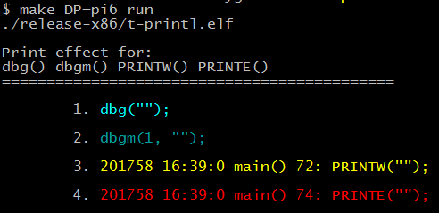
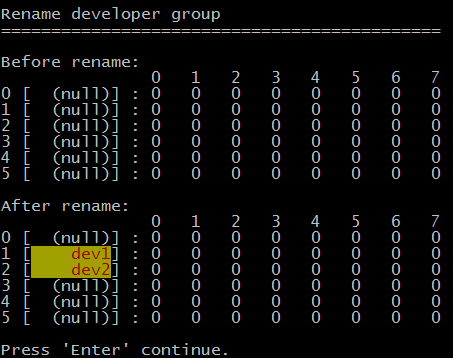
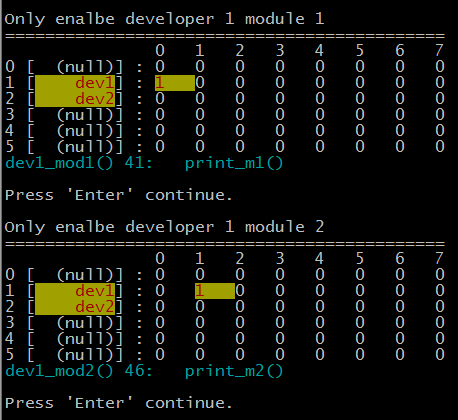
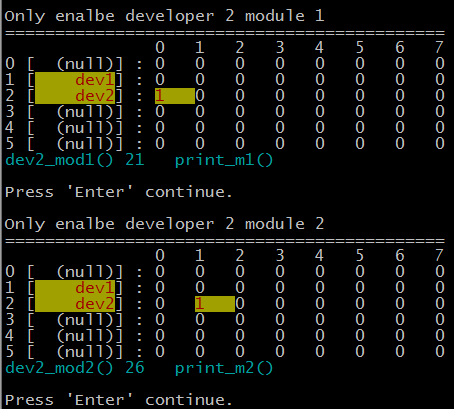
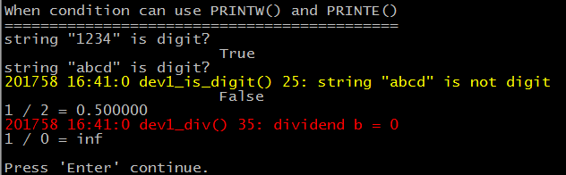

printl多开发者调试
==================

# 产生背景
<!--   为了集成开发快速定位软件缺陷、分离各开发者调试、反应软件缺陷程度。 -->

  多开发者同时做一个项目，各自开发独立模块，各开发者在代码中添加调试
  打印信息，这种习惯普遍存在也值得提倡，在后期集成时被告知存在BUG时，
  可通过调试信息方便查找缺陷。

  不过当各开发者提交各自的模块集成后，集成开发者将看到若干与自己无直接
  关系的打印输出。两难的抉择：去掉打印反馈BUG时负责维护模块的开发者
  无法快速定位，保留打印又影响集成开发者的正常开发。

  printl 模块提供这种机制，集成开发者在开发时可关闭所有其他开发者的 __普通输出__ ，只有在需要时候才打开，不过 __异常输出__ 是不能在运行
  阶段关闭的。每个开发者的输出内容都在私有空间中，开发前要开发者之间协商
  私有空间，若空间冲突则会导致同时允许（或禁止）两个开发者的输出。


# 使能
  分级显示打印信息，

  使用printl 代码开始出包含头文件 __printl.h__，make menuconfig 选择 __use printl__，调试版本建议按照默认选项开启全部打印级别。

  发布版建议选择 __unuse assert,dbg (-DNDEBUG)__ 关闭调试信息。

```
  |   Location:
  |     -> Project
  |       -> Print level
  |           [*] use printl 
  |           [ ]   unuse PRINTW
  |           [ ]   unuse PRINTE
  |           [ ]   unuse dbgm
  |           [ ] unuse assert,dbg (-DNDEBUG)
```

# 分色显示

  行分别是 __dbg()、dbgm()、PRINTW()、PRINTE()__ 打印色彩输出效果。
  输出等级分别是 __调试、模块调试、警告、错误__ 
  所有显示都可以配置时将其关闭。

  

  __dbg__ 与printf相当，高亮显示只是为了让开发者知道该内容是 __调试信息__，
  可以被关闭的。

  __PRINTW与PRINTE__ 使用没任何差异，它的存在只是为了提醒开发者代码运行 __异常__，并标注异常的 __严重等级__ 、异常时间戳、以及代码行。  

  __PRINTW__ 表示代码运行不符合预定规则，但仍可以继续运行。  
  __PRINTE__ 表示代码运行不符合预定规则，状态异常，该停止下来检查模块调用者的
  输入产生是否合法，模块所依赖的环境是否异常，他与断言（assert）的区别在于，断言会立即中断程序的执行，__PRINTE__ 不会。发布版本软件不能存在断言，
  但仍然应该做断言等效的检查，并抛出异常，__PRINTE__ 是这段异常描述， 并直接跳出模块函数。

  警告与错误的区分。

  应用程序需要等待鼠标操作，程序在等待前检查鼠标是否存在，如果鼠标不存在则用
  __PRINTW__ 报告，依旧可以进入等待，这没什么大不了的，随时插入USB鼠标输入信
  息，应用程序能继续接下来的运作。

  应用程序需要获取当前硬件时间，首先检查在RTC是否异常：晶振是否工作、寄存器
  能否读写，异常则用 __PRINTE__ 报告，相关函数接口立即返回错误码。
  RTC不同鼠标，通常位于设备内部，坏了就没法用外部RTC代替。

  __PRINTW与PRINTE__虽然能在编译阶段屏蔽它们，但这么做相当于隐瞒缺陷不报，不提倡。

  __dbgm__ 是唯一可以在代码运行过程中随时屏蔽的接口，只有代码第1个参数不为0则输出，是集成开发者关闭其他开发者调试打印的关键，LEVEL_ID、LEVEL_ID_BIT
  就是管理多开发者调试打印空间的入口，后文将详细介绍，

# LEVEL_ID多开发者调试信息管理
  本质上它就是个位图，位图区域 6bit x 64bit， 它支持6个开发者同时开发，每个开发者占用横向64bit，表示每个开发者最多可以为64个模块分别屏蔽调试信息。

```
  #define LEVEL_ID(n,m) ( g_level[(n) * SUB_GROUP + (m)] )
  #define LEVEL_ID_BIT(n,m,b) ((1 << (b)) & LEVEL_ID((n),(m)) )
```
  
  刚开始位图是空的，6个开发者所有模块信息均被关闭，为各开发者占用哪一行，给其中
  用到的行命名。

  - dev1 开发者占用第1行的64bit
  - dev2 开发者占用第2行的64bit
  
```
pl_prefix(1, "dev1");
pl_prefix(2, "dev2");
```


  

  分别打开dev1 的两模块输出

```
LEVEL_ID(1, 0) = 1;LEVEL_ID(1, 1) = 0;
LEVEL_ID(1, 0) = 0;LEVEL_ID(1, 1) = 1;
```

  
  
  关闭dev1所有输出，分别打开dev2两模块输出

```
LEVEL_ID(1, 0) = 0;LEVEL_ID(1, 1) = 0;

LEVEL_ID(2, 0) = 1;LEVEL_ID(2, 1) = 0;
LEVEL_ID(2, 0) = 0;LEVEL_ID(2, 1) = 1;
```
  

  演示 __PRINTW、PRINTE__ 的工程应用：

  - __PRINTW__ 要求输入数字，但"abcd"显然不是
  - __PRINTE__ 做除法运算，分母为0

  
